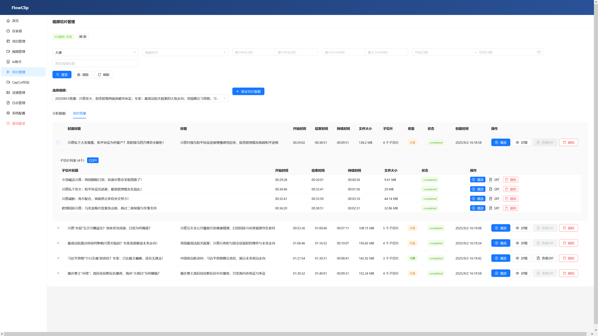
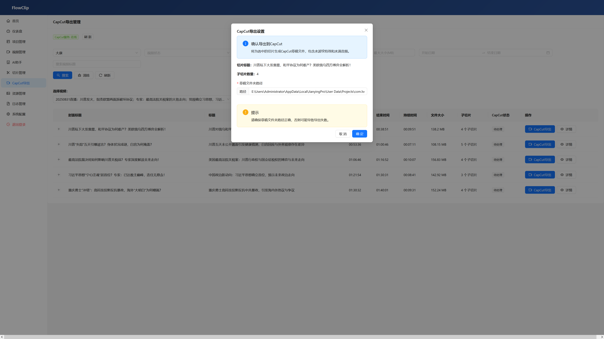

# FlowClip

FlowClip is a comprehensive video processing platform that automatically downloads YouTube videos, extracts audio, generates subtitles, and creates video slices based on AI analysis. The system is designed for content creators and media professionals to automate video editing workflows.

## Features

- **YouTube Video Download**: Support for high-quality video downloads, including videos that require login
- **Audio Processing**: Automatic audio extraction and silence-based splitting
- **Automatic Speech Recognition (ASR)**: Generate accurate video subtitles using SenseVoice
- **AI Video Analysis**: Intelligent analysis of video content and slice suggestions using LLM technology
- **Video Slicing**: Automatically create video clips based on AI analysis results
- **CapCut Integration**: Export to CapCut drafts with effects and audio enhancement
- **Real-time Progress Tracking**: Real-time processing progress updates via WebSocket
- **Project Management**: Organize and manage multiple video projects

## Screenshots

<div align="center">
  
  
  
  
  
  
  
</div>

## Technical Architecture

### Backend Stack
- **FastAPI**: High-performance asynchronous Python web framework
- **Celery**: Distributed task queue for background processing
- **Redis**: Task queue and caching
- **MinIO**: S3-compatible object storage
- **MySQL**: Data persistence with aiomysql async driver
- **FFmpeg**: Video and audio processing
- **yt-dlp**: YouTube video downloading

### Frontend Stack
- **React**: Modern JavaScript UI library
- **TypeScript**: Type-safe JavaScript
- **Ant Design**: Enterprise UI component library
- **Zustand**: Lightweight state management
- **Vite**: Fast build tool

## Automated Deployment

For easier deployment, FlowClip provides an automated deployment script that handles configuration and service setup.

### Using the Deployment Script

The `deploy.sh` script automates the deployment process:

```bash
# Make the script executable
chmod +x deploy.sh

# Run the deployment script with your server's public IP
./deploy.sh <your-public-ip>

# Or specify both public and private IPs
./deploy.sh <public-ip> <private-ip>
```

The script will:
- Automatically detect private IP if not provided
- Create and validate `.env` configuration file
- Backup existing configurations
- Check Docker environment
- Verify service dependencies
- Initialize database configuration
- Provide access URLs after deployment

### Requirements
- Python 3.8+
- Node.js 16+
- Docker and Docker Compose
- Redis
- MinIO
- MySQL

### Installation Steps

#### Option 1: Automated Deployment (Recommended)

Use the provided deployment script for automatic setup:

```bash
# Make the script executable
chmod +x deploy.sh

# Run the deployment script with your server's public IP
./deploy.sh <your-public-ip>

# Or specify both public and private IPs
./deploy.sh <public-ip> <private-ip>
```

The script will automatically handle environment configuration, service startup, and database initialization.

#### Option 2: Manual Installation

1. Clone the repository:
```bash
git clone https://github.com/youyouhe/flowclip.git
cd flowclip
```

2. Start basic services:
```bash
docker-compose up -d redis minio
```

3. Configure environment variables (refer to `.env.example`)

4. Install backend dependencies:
```bash
cd backend
pip install -r requirements.txt
```

5. Run database migrations:
```bash
alembic upgrade head
```

6. Start the backend service:
```bash
uvicorn app.main:app --host 0.0.0.0 --port 8001
```

7. Start Celery worker processes:
```bash
celery -A app.core.celery worker --loglevel=info
```

8. Install frontend dependencies:
```bash
cd frontend
npm install
```

9. Start the frontend development server:
```bash
npm run dev
```

## Usage Guide

1. Create a project and upload or download a YouTube video
2. The system automatically processes audio extraction and subtitle generation
3. Use the AI analysis feature to generate video slice suggestions
4. Review and apply slice data
5. Export to CapCut for final editing

## Configuration

Main environment variables:
- `DATABASE_URL`: Database connection string
- `REDIS_URL`: Redis connection URL
- `MINIO_ENDPOINT`: MinIO service endpoint
- `OPENAI_API_KEY`: LLM API key
- `YOUTUBE_COOKIES_FILE`: YouTube cookies file path

### ASR Service Configuration

FlowClip supports two ASR (Automatic Speech Recognition) models for generating subtitles:

1. **Whisper Model** (Default):
   - URL: `http://192.168.8.107:5001`
   - High accuracy for multiple languages
   - Better performance on complex audio

2. **SenseVoice Model**:
   - URL: `http://192.168.8.107:5002`
   - Optimized for Chinese language recognition
   - Faster processing speed

You can switch between these models in the System Configuration page or by setting the `asr_model_type` to either "whisper" or "sense".

### CapCut Integration Configuration

FlowClip can export video slices directly to CapCut for further editing:

- `CAPCUT_API_URL`: CapCut service API endpoint (default: `http://192.168.8.107:9002`)
- `CAPCUT_DRAFT_FOLDER`: Local folder path where CapCut drafts will be saved

The CapCut integration allows you to:
- Automatically create video drafts with your sliced content
- Apply effects and audio enhancements
- Add subtitles and text overlays
- Export projects ready for fine-tuning in CapCut

### 获取和部署ASR与CapCut服务

The ASR and CapCut services are provided as separate repositories that you can download and deploy:

1. **CapCut API Service**: 
   - Repository: https://github.com/youyouhe/CapCutAPI-Docker.git
   - Provides the API interface for creating and managing CapCut drafts

2. **ASR Service (Faster Whisper)**:
   - Repository: https://github.com/youyouhe/faster-whisper.git
   - Provides both Whisper and SenseVoice ASR models for subtitle generation

Follow the instructions in each repository's README to set up and deploy these services.

## Development

### Project Structure
```
flowclip/
├── backend/           # FastAPI backend service
│   ├── app/           # Application core code
│   │   ├── api/       # REST API endpoints
│   │   ├── core/      # Core configuration and services
│   │   ├── models/    # Database models
│   │   ├── schemas/   # Pydantic data schemas
│   │   ├── services/  # Business logic services
│   │   └── tasks/     # Celery tasks
│   ├── tests/         # Test code
│   └── alembic/       # Database migrations
└── frontend/          # React frontend application
    ├── src/           # Source code
    │   ├── pages/     # Page components
    │   ├── services/  # API clients
    │   ├── components/ # Reusable components
    │   └── store/     # State management
    └── public/        # Static resources
```

### Testing
```bash
# Backend tests
cd backend
pytest

# Frontend tests
cd frontend
npm test
```

## Contributing

Issues and Pull Requests are welcome. Please ensure you follow the code standards and write corresponding tests.

## License

[TBD]

## Contact

For any questions, please contact the project maintainers.