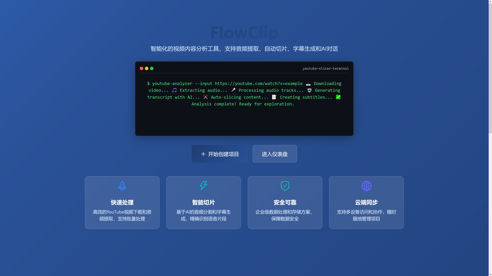
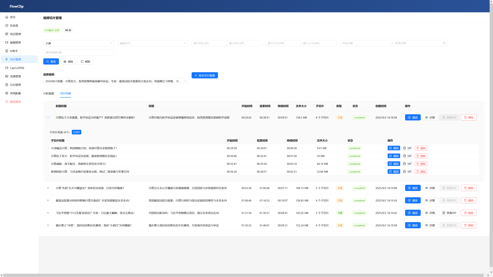
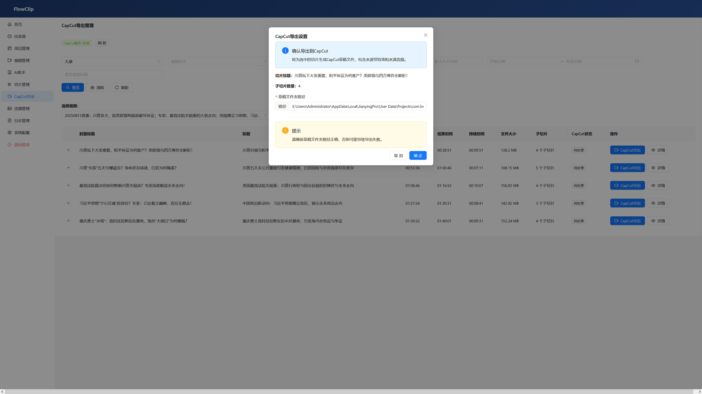
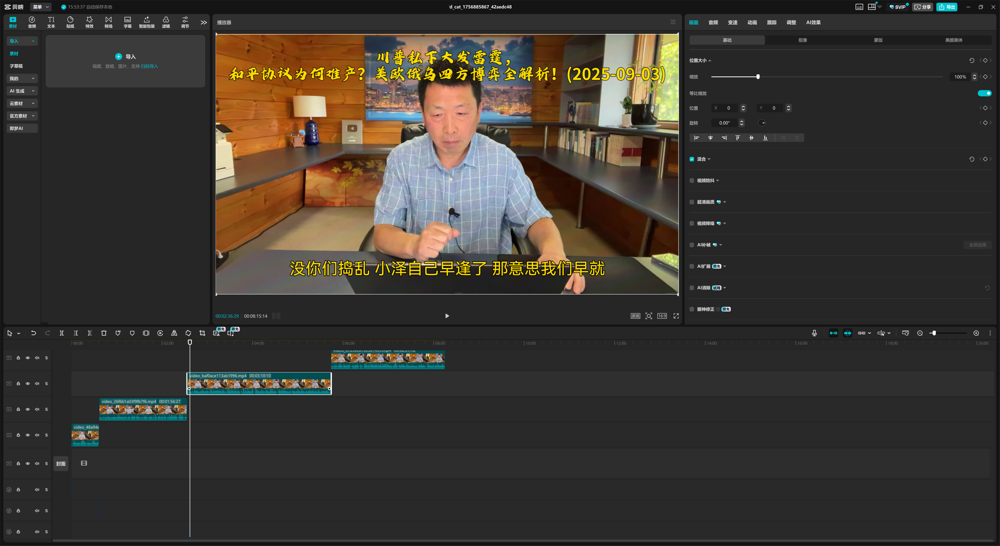

# FlowClip

FlowClip 是一个完整的视频处理平台，可自动下载 YouTube 视频、提取音频、生成字幕，并基于 AI 分析创建视频切片。该系统专为内容创作者和媒体专业人士设计，可自动化视频编辑工作流程。

## 功能特性

- **YouTube 视频下载**：支持高质量视频下载，包括需要登录的视频
- **音频处理**：自动提取音频并进行静音分割
- **自动语音识别 (ASR)**：使用 SenseVoice 生成准确的视频字幕
- **AI 视频分析**：利用 LLM 技术智能分析视频内容并生成切片建议
- **视频切片**：根据 AI 分析结果自动创建视频片段
- **CapCut 集成**：导出到 CapCut 草稿，包含特效和音频增强
- **实时进度跟踪**：通过 WebSocket 提供处理进度实时更新
- **项目管理**：组织和管理多个视频项目

## 界面截图

<div align="center">
  
  
  
  
  
  
  
</div>

## 技术架构

### 后端技术栈
- **FastAPI**：高性能异步 Python Web 框架
- **Celery**：分布式任务队列，用于后台处理
- **Redis**：任务队列和缓存
- **MinIO**：S3 兼容的对象存储
- **SQLite/PostgreSQL**：数据持久化
- **FFmpeg**：视频和音频处理
- **yt-dlp**：YouTube 视频下载

### 前端技术栈
- **React**：现代 JavaScript UI 库
- **TypeScript**：类型安全的 JavaScript
- **Ant Design**：企业级 UI 组件库
- **Zustand**：轻量级状态管理
- **Vite**：快速构建工具

## 快速开始

### 环境要求
- Python 3.8+
- Node.js 16+
- Docker 和 Docker Compose
- Redis
- MinIO

### 安装步骤

#### 方式一：自动化部署（推荐）

使用提供的部署脚本进行自动安装：

```bash
# 设置脚本可执行权限
chmod +x deploy.sh

# 使用服务器公网IP运行部署脚本
./deploy.sh <你的公网IP>

# 或者同时指定公网和私网IP
./deploy.sh <公网IP> <私网IP>
```

脚本将自动处理环境配置、服务启动和数据库初始化。

#### 方式二：手动安装

1. 克隆仓库：
```bash
git clone https://github.com/youyouhe/flowclip.git
cd flowclip
```

2. 启动基础服务：
```bash
docker-compose up -d redis minio
```

3. 配置环境变量（参考 `.env.example`）

4. 安装后端依赖：
```bash
cd backend
pip install -r requirements.txt
```

5. 运行数据库迁移：
```bash
alembic upgrade head
```

6. 启动后端服务：
```bash
uvicorn app.main:app --host 0.0.0.0 --port 8001
```

7. 启动 Celery 工作进程：
```bash
celery -A app.core.celery worker --loglevel=info
```

8. 安装前端依赖：
```bash
cd frontend
npm install
```

9. 启动前端开发服务器：
```bash
npm run dev
```

## 使用指南

1. 创建项目并上传或下载 YouTube 视频
2. 系统自动处理音频提取和字幕生成
3. 使用 AI 分析功能生成视频切片建议
4. 审核并应用切片数据
5. 导出到 CapCut 进行最终编辑

## 配置说明

主要环境变量：
- `DATABASE_URL`：数据库连接字符串
- `REDIS_URL`：Redis 连接 URL
- `MINIO_ENDPOINT`：MinIO 服务端点
- `OPENAI_API_KEY`：LLM API 密钥
- `YOUTUBE_COOKIES_FILE`：YouTube cookies 文件路径

## 开发

### 项目结构
```
flowclip/
├── backend/           # FastAPI 后端服务
│   ├── app/           # 应用核心代码
│   │   ├── api/       # REST API 端点
│   │   ├── core/      # 核心配置和服务
│   │   ├── models/    # 数据库模型
│   │   ├── schemas/   # Pydantic 数据模式
│   │   ├── services/  # 业务逻辑服务
│   │   └── tasks/     # Celery 任务
│   ├── tests/         # 测试代码
│   └── alembic/       # 数据库迁移
└── frontend/          # React 前端应用
    ├── src/           # 源代码
    │   ├── pages/     # 页面组件
    │   ├── services/  # API 客户端
    │   ├── components/ # 可复用组件
    │   └── store/     # 状态管理
    └── public/        # 静态资源
```

### 测试
```bash
# 后端测试
cd backend
pytest

# 前端测试
cd frontend
npm test
```

## 贡献

欢迎提交 Issue 和 Pull Request。请确保遵循代码规范并编写相应的测试。

## 许可证

[待定]

## 联系方式

如有问题，请联系项目维护者。